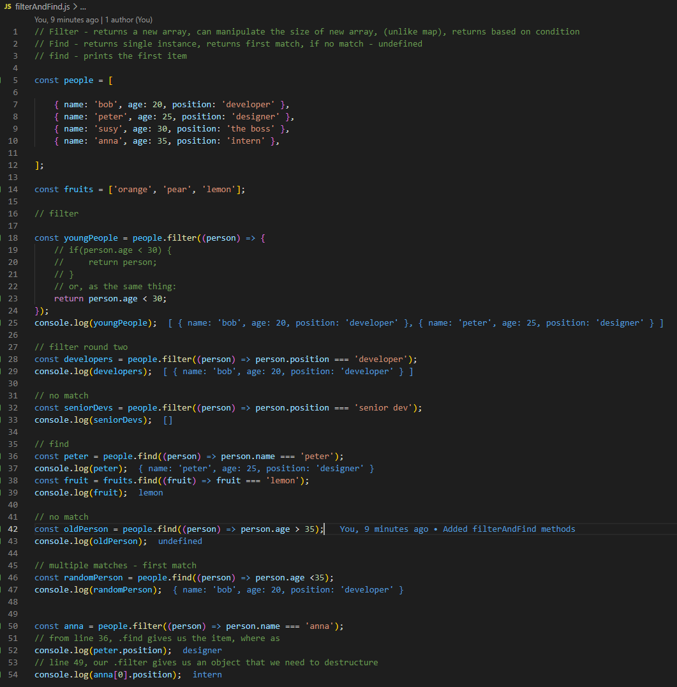
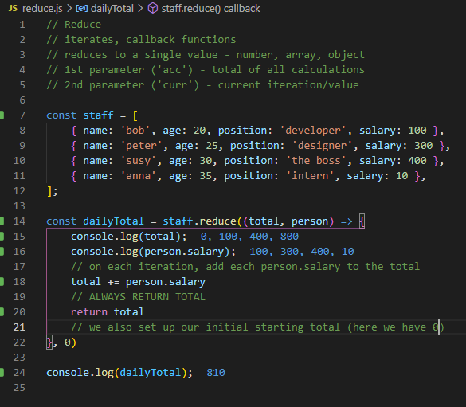

<h1 align="center">JavaScript Notes </h1>

    
    
    
    
    
    

  

    
    
    
    
    

## Table of Contents

- [Description](#description)
- [Code](#code)
- [Filter and Find](#FilterAndFind)
- [Reduce](#Reduce)
- [Questions](#questions)

## Description

Notes to help keep track of different JavaScript ideas, functions, etc

## Code

### FilterAndFind

### Reduce

## Questions

Feel free to contact me with any questions.

[Email](mailto:themancalledzac@gmail.com)

[Github](https://github.com/themancalledzac)

[Twitter](https://twitter.com/themancalledzac)

[Instagram](https://www.instagram.com/themancalledzac/)
